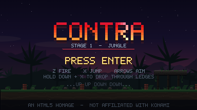
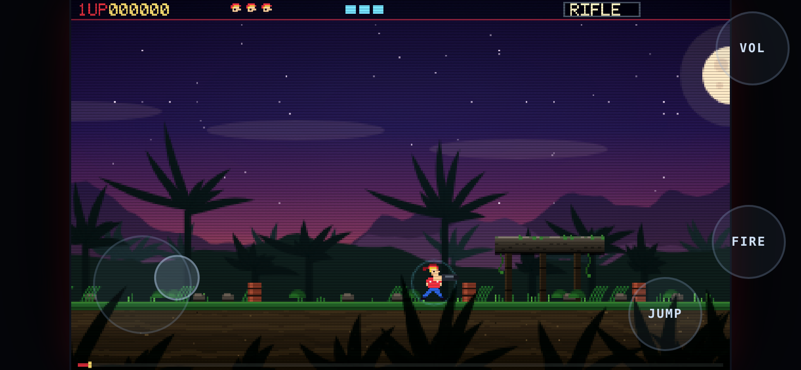
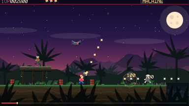
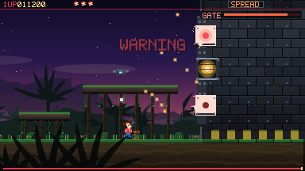

# IRONVINE — Stages 1–2

An original HTML5 run-and-gun.
One file, no build step, no dependencies, **no asset files at all** — every sprite,
every tree, every note of the soundtrack is generated in code at load time.



## Play it

Download [`index.html`](index.html) and open it in a browser. That's the whole game.

Or serve the folder if you prefer:

```bash
python3 -m http.server 8000
```

## Install on your iPhone home screen

The game ships everything needed to install as a full-screen app with its own icon
(`apple-touch-icon` + [`manifest.json`](manifest.json), safe-area padding, zoom and
scroll suppression). You just need to open it from a **URL** in Safari — via GitHub
Pages that's:

**`https://maximeaelita.github.io/test/contra/`**

Tap **Share** → **Add to Home Screen** → **Add**. It launches full-screen with no
Safari chrome. Hold the phone in **landscape** — the game is a 384×216 widescreen
playfield, and in portrait it shows a rotate prompt instead.

On Android/desktop Chrome the same URL offers an **Install app** prompt.

## Controls

On a phone or tablet the on-screen pad appears automatically: a **thumbstick** on the
left for 8-way movement and aim, **FIRE** and **JUMP** on the right, **VOL** to mute.
It is genuine multi-touch, so you can run, aim diagonally and fire at the same time,
and hold down + JUMP to drop through a ledge. Tap the playfield to start.

The stick uses a **floating origin**: put your thumb down anywhere in the lower-left
of the screen and the ring centres itself there, so landing is neutral and you never
have to look for a target. Direction only starts once you move. Sectors are
**weighted** — running left/right gets the widest arc, the 45° aim stays generous,
straight up/down are narrower — and a held direction **sticks** until your thumb is
clearly past the boundary, so a shaky grip can't strobe between two directions.



On a keyboard:

| Key | Action |
| --- | --- |
| <kbd>←</kbd> <kbd>↑</kbd> <kbd>↓</kbd> <kbd>→</kbd> | Move and aim (8-way) |
| <kbd>Z</kbd> or **left click** | Fire |
| <kbd>X</kbd> | Jump |
| <kbd>↓</kbd> | Go prone — shots pass overhead |
| <kbd>↓</kbd> + <kbd>X</kbd> | Drop through a ledge |
| <kbd>Enter</kbd> | Start |
| <kbd>Esc</kbd> / <kbd>P</kbd> | Pause |
| <kbd>F</kbd> | Fullscreen |
| <kbd>M</kbd> | Mute |

<kbd>WASD</kbd> / <kbd>J</kbd> / <kbd>K</kbd> also work.

### Gamepad

A standard-mapping pad works throughout — that is what both XInput and the Steam
Deck present. Keyboard and pad can be used in the same session; pad state is
written on button *edges* only, so neither clobbers the other.

| Pad | Action |
| --- | --- |
| Left stick / D-pad | Move and aim (8-way) |
| **X** / RB / RT | Fire |
| **A** / LB / LT | Jump |
| **Start** / Back | Pause, and start from the title |

### Options

<kbd>O</kbd> from the title, or **OPTIONS** in the pause menu. Master / music / SFX
volume, mute, fullscreen, and **rebindable keys** for every movement and action —
select a row, press the key you want, and it is taken off whatever action held it
before so bindings stay unique. **RESET TO DEFAULTS** puts everything back.

Settings and your best run are kept in `localStorage` under `ironvine.v1`. Writes
are wrapped in try/catch, because private-mode Safari throws on `setItem` and a
failed save must never take the game down.

### Continues

Losing your last life no longer throws away the run. The game-over screen offers
**CONTINUE**, which rebuilds the stage you died on with a fresh set of lives and
keeps the score you had earned. Your best score and furthest stage are shown on
the title screen.

### Pause

<kbd>Esc</kbd>, <kbd>P</kbd>, the pad's **Start**, or the **II** button on touch.
The menu — RESUME · RESTART STAGE · OPTIONS · FULLSCREEN · QUIT TO TITLE — takes stick, d-pad,
keyboard or a tap on the line. Pausing suspends the `AudioContext` too, so the music
stops rather than playing to an empty screen. **RESTART STAGE** rebuilds the current
stage without touching your score or lives.

And yes, the code works on the title screen:

```
↑ ↑ ↓ ↓ ← → ← → B A
```

## Screenshots





## Weapons

Shoot down the falcon pods that fly overhead to drop a weapon crate.

| | Weapon | Behaviour |
| --- | --- | --- |
| **R** | Rifle | Default. Semi-auto, capped at 5 shots on screen. |
| **M** | Machine | Fast auto fire. |
| **S** | Spread | Five-way fan, the crowd-clearer. |
| **L** | Laser | Piercing beam, triple damage, low rate of fire. |
| **F** | Flame | Spiralling fireballs. |
| **B** | Barrier | Ten seconds of invulnerability. |

## Shield

You carry a shield that soaks **3 hits**. Each absorb costs a pip, flashes the ring
around you and gives a short mercy window, so a single burst can't strip all three at
once. Stay **5 seconds without being hit** and it refills to full — the thin bar under
the pips is that timer running.

Pits are still lethal: falling kills you outright, shield or not.

## Stages

| | Stage | |
| --- | --- | --- |
| **1** | Jungle | Night jungle under a low moon — the run to the fortress gate. |
| **2** | Gorge | A waterfall gorge: wet slate cliffs, cascades falling through frame, chasms of black water, and a **downstream current** on the lips that shoves you toward the drop. Ends at the dam face. |

Clearing a stage carries your score, lives and current weapon straight into the next
one; only the world is rebuilt. Dying back to the title restarts at stage 1.

## Enemies

Runners, gunners, pop-up jumpers, aiming turrets, sniper bunkers and arcing
mortars — then the fortress gate itself: two tracking gun pods and an armoured
core, with drones launched at you throughout.

The camera follows you **both ways**, so you can double back for a turret or bunker
you ran past. Backtracking is safe: waves you have already triggered don't re-spawn,
and the wave ahead of you isn't discarded while you're behind it.

## Bosses

**Stage 1 — THE GATE.** Two tracking gun pods and an armoured core, at heights
chosen so each is hit by 45° fire from a *different* standing distance. Picking
your range is the fight.

**Stage 2 — THE SLUICE.** A different problem entirely. Three sluice gates are
armoured shut and rounds spark off them; they cycle open on staggered timers and
can only be hurt while open, and an open gate pours water at you. The outflow core
at the base stays sealed until every gate is destroyed. And each gate you break
floods the gorge higher — the floor you are standing on stops being available, so
you fight your way up the ledges as you go. The flood drowns you like a pit: the
shield does not save you.

## How it works

Everything is procedural. There is not a single `.png` shipped with the game
(the screenshots above are just for this README).

- **Sprites** are ASCII-art string arrays paired with palette maps, rasterised
  into offscreen canvases at boot, with flipped and hit-flash variants baked
  per sprite.
- **The jungle** — sky gradient, moon, mountain ridges, palm silhouettes, dirt
  strata, grass, vines, the fortress masonry — is painted once into layered
  offscreen canvases using value-noise fBm, then scrolled at four parallax
  depths.
- **The gorge** uses the same machinery with its own shapes: slate bedding planes,
  moss caps, seepage streaks and drips, black chasm water, and a dam face. The
  cascades are baked into the parallax layer, with animated streaks and plunge-pool
  spray drawn over them each frame at the same scroll rate, so the motion lands
  exactly on the painted falls.
- **Audio** is a small WebAudio synth: square/triangle/saw voices plus filtered
  noise, driven by a step sequencer running an original 64-step march.
- **Lighting** is one half-resolution buffer. Muzzle flashes, explosions, the
  shield and every shot in flight are drawn into it as additive radial sprites,
  then it is composited back with `lighter` — upscaling that small buffer with
  smoothing on *is* the blur, so a single layer gives dynamic light and bloom at
  once. Colour grading and the vignette are pre-baked canvases, and the drifting
  motes are bucketed by alpha so a frame costs five `fillStyle` changes, not
  forty-four.
- **The loop** is a fixed 60 Hz accumulator with a spiral-of-death guard,
  rendered to a 384×216 canvas that is integer-scaled with
  `image-rendering: pixelated`.

It's cheap to run. The original renderer measured roughly **0.5 ms per frame**
in a busy scene — boss, drones, thirty-plus bullets and several explosions. The
lighting pass roughly doubles that, and it still holds a locked 60 fps with
headroom to spare (measured under a *software* rasteriser, which is the
pessimistic case — real hardware composites these layers on the GPU).

## Desktop / Steam

[`steam/`](./steam) wraps the game in Electron for a Windows build — see its README.
The shell is deliberately thin: the game already handles fullscreen, pause and
gamepad itself.

Still missing before a Steam release: Steamworks integration — achievements, Cloud
saves and the overlay all need a real App ID issued by Valve plus the native
`steamworks.js` module, so none of it can be wired up until the app exists in
Steamworks.

## Status

Stages 1 and 2 are complete and finishable.

Adding stage 2 did need engine changes, despite an earlier note here claiming
otherwise: `LVL_W` was a hard constant, the terrain and backdrop painters had the
jungle's geometry and palette baked in, and clearing a stage returned to the title
rather than advancing. Those are now per-stage — `buildLevel()`, `buildBackdrop()`,
`buildTerrainCanvas()` and `buildSpawnTable()` dispatch on `stage`, and
`nextStage()` rebuilds the world while leaving the run intact. A third stage means
adding another set of those four builders plus a `STAGE_NAMES` entry.

## Legal

IRONVINE is an original work. Every sprite, every metre of terrain and every note
of the soundtrack is generated by the code in this repository — there are no
third-party assets, no third-party code, and no third-party trademarks. It began
as a study of the arcade run-and-gun genre and was renamed and re-skinned before
any commercial release so that it stands on its own.

Released under the MIT License (see [LICENSE](LICENSE)).
